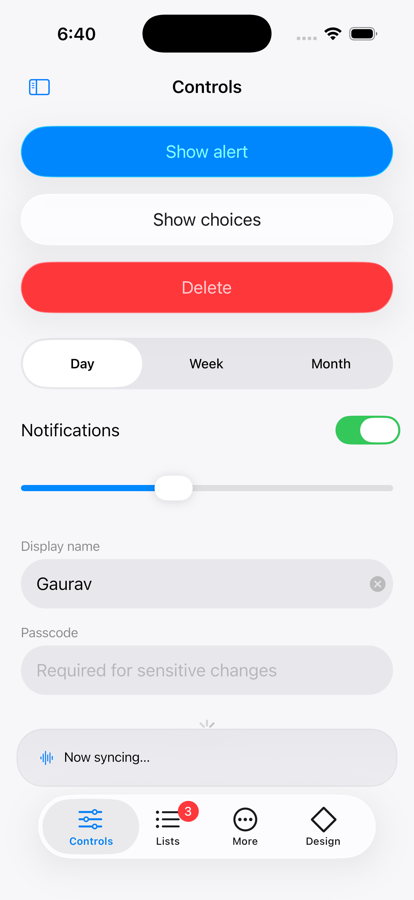
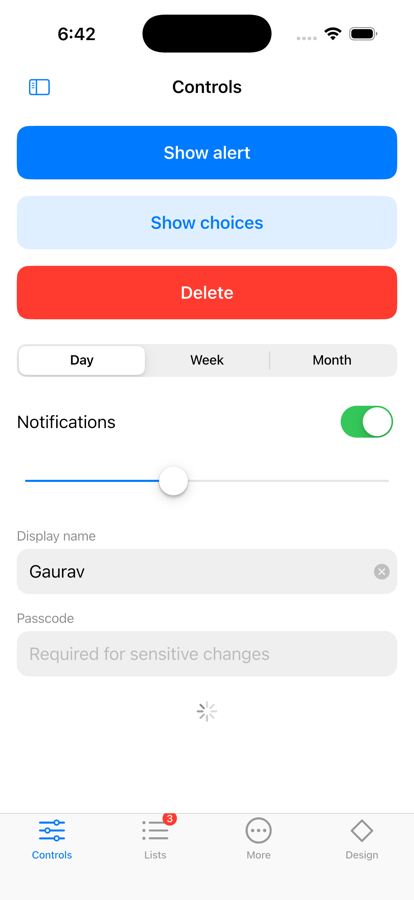
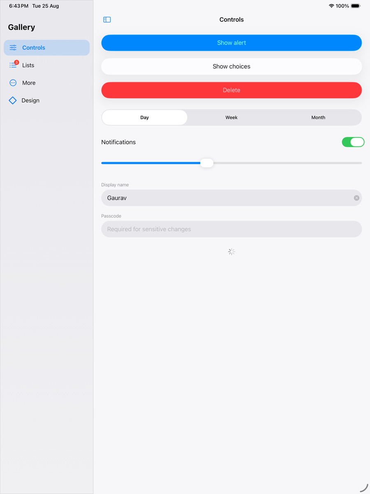

# native_adaptive_ui

Adaptive Flutter widgets that resolve by **platform, OS version, and form factor** — not just `Platform.isIOS`.

[](https://pub.dev/packages/native_adaptive_ui)
[](LICENSE)

---

## The problem

Every adaptive UI package asks one question: *is this iOS or Android?* That was
enough when each platform had exactly one current design language.

It isn't enough any more:

| | Current | Previous |
|---|---|---|
| iPhone | iOS 26 — Liquid Glass, floating tab bars, concentric radii | iOS 18 — flat Cupertino |
| iPad | iPadOS 26 — sidebars, popovers, split view | iPadOS 18 — same, without glass |
| Android | 16 — Material 3 Expressive, spring motion, shape morphing | 12–15 — Material 3 |
| Mac | macOS 26 Tahoe — Liquid Glass | macOS 15 — Aqua-derived |

A package that renders "Cupertino on iOS" now ships an iOS 18 app to an iOS 26
device. It is adaptive to the *platform* and blind to the *version*.

`native_adaptive_ui` resolves a **`DesignEra`** from all three inputs, and every
widget renders against that.

## Same code, every era

<table>
<tr>
<td></td>
<td></td>
<td></td>
</tr>
<tr>
<td align="center">iOS 26 · Liquid Glass</td>
<td align="center">iOS 18 · classic</td>
<td align="center">iPadOS 26 · sidebar</td>
</tr>
</table>

The same `AdaptiveNavigationScaffold` and `AdaptiveButton` calls, run on iOS 26,
iOS 18 and iPadOS 26 without an `if (Platform.isIOS)` in sight. The example
app's own [era picker](screenshots/design_era_picker.png) is what generated
these — any `DesignEra` renders on any machine, device lab not required.

## Install

```yaml
dependencies:
  native_adaptive_ui: ^0.1.0
```

```dart
Future<void> main() async {
  WidgetsFlutterBinding.ensureInitialized();
  await NativeAdaptiveUi.ensureInitialized();
  runApp(const MyApp());
}
```

That one `await` is what makes era resolution available synchronously during
build. Skip it and the package falls back to iOS 18 / Android 15 styling and
tells you so in debug.

### Apple platforms: Swift Package Manager or CocoaPods

Both work, from a single copy of the Swift sources.

```sh
flutter config --enable-swift-package-manager
```

SPM manifests live at `ios/native_adaptive_ui/Package.swift` and
`macos/native_adaptive_ui/Package.swift`; the CocoaPods podspecs point at the
same `Sources` directory, so nothing is duplicated and the two toolchains can
never drift apart. A `PrivacyInfo.xcprivacy` ships with each — the plugin
collects nothing, tracks nothing, and uses no required-reason APIs, but App
Store review expects the declaration to be present rather than absent.

## Use

```dart
AdaptiveApp(
  home: AdaptiveNavigationScaffold(
    title: 'Library',
    selectedIndex: index,
    onDestinationSelected: (i) => setState(() => index = i),
    destinations: const [
      AdaptiveDestination(label: 'Home', icon: Icon(Icons.home)),
      AdaptiveDestination(label: 'Search', icon: Icon(Icons.search)),
    ],
    body: AdaptiveScaffold(
      title: 'Home',
      body: AdaptiveListSection(
        header: 'Recent',
        children: [
          AdaptiveListTile(title: 'Design notes', onTap: open),
        ],
      ),
    ),
  ),
)
```

Same code renders as:

- **iPhone, iOS 26** — glass navigation bar, floating glass tab pill, continuous corners
- **iPhone, iOS 18** — opaque Cupertino bar, standard tab bar
- **iPad, iPadOS 26** — sidebar navigation, popovers instead of bottom sheets
- **iPad in Slide Over** — back to a tab bar, because the window is phone-width
- **Android 16** — Material 3 Expressive with spring press feedback
- **Android 12–15** — Material 3 with dynamic colour
- **macOS Tahoe** — pointer densities, 28pt controls, glass sidebar

## What makes this different

**Version awareness, not just platform awareness.** `DesignEra` is the core
type. Version thresholds live in exactly one file, so supporting the next OS is
a one-line change, not a hunt through widget code.

**iPad is a first-class target.** Most Flutter apps treat an iPad as a large
iPhone. Here, expanded windows get sidebar navigation and anchored popovers —
and narrow ones get tab bars again, because the layout follows the *window*
while the design era follows the *OS*.

**Native-first, with a fallback that always works.** Where a real UIKit control
exists and is verified, it is embedded. Everywhere else — and on every
simulator, and under `NativePolicy.dartOnly` — an equivalent Dart implementation
renders instead. No blank rectangles, no `null` widgets, no
"do not use in production" warnings.

**Migration-ready.** Flutter froze Material and Cupertino in the SDK in April
2026 and shipped them as the standalone `material_ui` and `cupertino_ui`
packages; the SDK copies are deprecated from November 2026. Every Material and
Cupertino import in this package goes through a single file
(`lib/src/design_systems/design_imports.dart`), so that migration is a two-line
change here rather than a rewrite in your app.

## Controlling native rendering

```dart
// App-wide
NativeAdaptiveUi.policy = NativePolicy.dartOnly;

// Per subtree
AdaptiveScope(policy: NativePolicy.dartOnly, child: mySettingsPage);

// Per widget
AdaptiveSlider(value: v, onChanged: onChange, preferNative: false);
```

`NativePolicy.dartOnly` is recommended for widget and golden tests: platform
views do not render in the test harness.

## Scrolling under translucent chrome

On Apple eras the navigation bar is translucent and content scrolls beneath it.
A `ListView` with no `padding` picks up the right inset from `MediaQuery`
automatically. The moment you pass your own `padding`, that automatic inset is
lost and your first rows hide behind the bar — so ask for it explicitly, from a
context *inside* the scaffold:

```dart
AdaptiveScaffold(
  title: 'Settings',
  body: Builder(
    builder: (context) => ListView(
      padding: context.adaptiveScrollPadding(horizontal: 16, vertical: 12),
      children: rows,
    ),
  ),
)
```

The same call covers the bottom, which matters on iOS 26 where the tab bar
floats as a glass pill over the content rather than sitting below it.

## iPad detail navigation

In the sidebar layout, `AdaptiveNavigationScaffold` hosts its own `Navigator`
for the detail pane, so `pushAdaptive` replaces only that pane and the sidebar
stays put. Switching destinations resets that pane's stack, which is what
iPadOS does. Pass `detailNavigator: false` when an outer router already owns
navigation and pushes should reach it instead.

## Previewing other eras

Any era can be rendered on any machine, which makes design review and
screenshots possible without a device lab:

```dart
AdaptiveApp(eraOverride: DesignEra.ipadLiquidGlass, home: ...)
```

In tests:

```dart
NativeAdaptiveUi.debugSetPlatform(
  PlatformInfo.fake(era: DesignEra.materialExpressive),
);
```

## Widgets

| Widget | Apple eras | Material eras |
|---|---|---|
| `AdaptiveApp` | `CupertinoApp` + transparent `Material` | `MaterialApp` |
| `AdaptiveScaffold` | `CupertinoPageScaffold`, glass bar on 26 | `Scaffold` + `AppBar` |
| `AdaptiveNavigationScaffold` | native `UITabBar` on iOS 26, else tab bar / sidebar by window | `NavigationBar` |
| `AdaptiveButton` | `CupertinoButton`, era geometry | `FilledButton` family |
| `AdaptiveSwitch` | `CupertinoSwitch` | `Switch` |
| `AdaptiveSlider` | native `UISlider` / `CupertinoSlider` | `Slider` |
| `AdaptiveTextField` | `CupertinoTextField` + outside label | `TextField` + floating label |
| `AdaptiveSegmentedControl` | native `UISegmentedControl` on 26, else sliding control | `SegmentedButton` |
| `AdaptiveListSection` / `Tile` | inset-grouped list | header + `ListTile` |
| `AdaptiveProgressIndicator` | activity indicator | wavy track on Android 16 |
| `showAdaptiveAlert` | native `UIAlertController` on 26, else `CupertinoAlertDialog` | `AlertDialog` |
| `showAdaptiveActionSheet` | native `UIAlertController` on 26, else action sheet / popover | modal bottom sheet |
| `adaptivePageRoute` | `CupertinoPageRoute` | `MaterialPageRoute` |

### Why glass comes from real controls

`UIVisualEffectView` samples its backdrop from the UIKit view hierarchy. Flutter
draws into a `CAMetalLayer`, which UIKit's backdrop capture cannot read — so a
glass surface laid over Flutter content has nothing to sample and renders inert.
`drawHierarchy` snapshotting does not help either; it cannot read Metal layers.

So genuine Liquid Glass — the material, the refraction, the interactive "liquid"
response to touch and hold — comes from embedding the **real UIKit control**, not
from painting glass behind Flutter-drawn chrome. On iOS 26 that means a real
`UITabBar`, `UISegmentedControl`, `UISwitch` and `UISlider`.

Alerts and action sheets take a second route: they are *presented* view
controllers rather than embedded views, so `UIAlertController` blurs the Flutter
scene beneath it the way it would any other content, and UIKit decides
popover-versus-sheet from the window's own traits.

The native tab bar needs an SF Symbol per destination, because a `UITabBarItem`
takes a `UIImage` and a Flutter widget cannot become one:

```dart
AdaptiveDestination(
  label: 'Home',
  icon: Icon(Icons.home),
  appleIcon: Icon(CupertinoIcons.house),
  sfSymbol: 'house',
  selectedSfSymbol: 'house.fill',
)
```

Omit `sfSymbol` and the Dart capsule renders instead — correct on every other
era, and an approximation on this one.

`GlassSurface` and `ConditionalGlass` are exported for building your own
era-aware **bars, sidebars and popovers**. They are a Dart approximation: a
`BackdropFilter`, a tint and a hairline. Use them for chrome with no UIKit
equivalent to embed, and for previewing glass eras on machines not running them.

Apple's guidance is explicit that Liquid Glass belongs to that functional layer
and not to content: *"Don't use Liquid Glass in the content layer… Limit these
effects to the most important functional elements in your app."* That is why
`AdaptiveButton` is a plain Cupertino button on iOS 26 rather than a glass
capsule — what the era changes is its height, corner radius and press feel, not
its material.

Sliders and toggles are the documented exception: they take on glass *while
being dragged*, as a signal of interactivity. That is a system behaviour on real
controls, and the package does not fake a permanent glass look in its place.

## A note on the Material ancestor crash

Material widgets need a `Material` ancestor, and `CupertinoApp` does not provide
one — which is why dropping a `ListTile` or `Tooltip` into an iOS build throws
*"No Material widget found"*. `AdaptiveApp` inserts a transparent `Material`
above the navigator on Apple eras, so mixing the two systems is safe and nothing
changes visually.

## Platform support

The package itself targets iOS 13+, iPadOS 13+, Android 5.0+ (API 21) and
macOS 10.15+, and requires Flutter 3.27 or newer. Your Flutter version may set a
higher floor of its own — Flutter 3.47 requires iOS 15 — and the higher of the
two wins. Web, Windows and Linux resolve to `DesignEra.fallback` and render
Material 3 — usable, but not a design target of this package.

Android compiles against API 36 (Android 16), which is the level
`DesignEra.materialExpressive` keys off; Kotlin 2.1, AGP 8.7, JVM 17.

## Design specs

The rules this package renders against — Apple's HIG, Material 3 token tables,
and the Flutter API facts behind them — are written down in
[`doc/design-specs.md`](doc/design-specs.md), with revision dates and sources.

Two things it records that are easy to get wrong from memory: most Apple
component pages have **not** been revised for iOS 26, so the Materials page is
the only binding glass rule for them; and Apple publishes almost no point
values, so the handful that do exist are listed together and the rest are marked
as unpublished rather than guessed.

It ends with the enhancement backlog — what the package does not yet implement
and which rule each item comes from.

## Status

0.1.0 is an early release. The API for `DesignEra`, `AdaptiveTokens` and the
core widgets is what the rest is built on and is unlikely to move; the native
component set is small on purpose and grows only as each embedding is verified
on hardware.

Issues and PRs welcome, particularly device reports from OS versions the author
does not have.

## License

MIT
